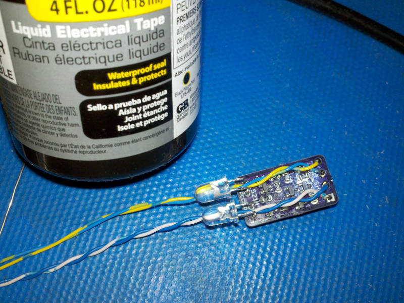
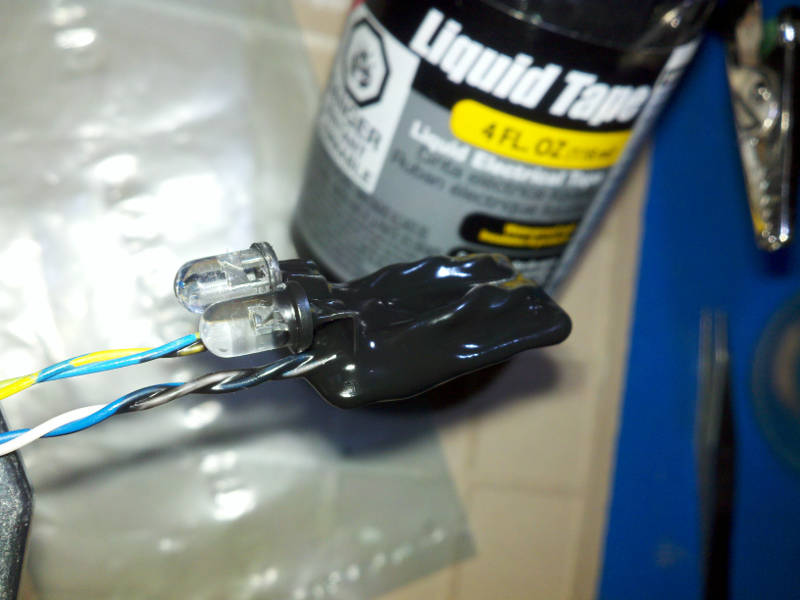

# Description

This shows the setup and methods used for evaluation of OneShot.

# Table of References


# Table Of Contents:

1. ^2 Time Capture
1. ^2 Dip In Liquid Tape
1. ^1 Pulse Timing @ 24V
1. ^0 Pulse Timing @ 24V


## ^2 Time Capture

Using Timer 1 Input Capture Unit (ICP1) on an RPUno board which has a 30ppm crystal I get the following reading. 

```
/0/count?
{"icp1":{"count":"4"}}
/0/capture? icp1,3
{"icp1":{"4":{"low":"382265510","high":"44964602"}}}

/0/count?
{"icp1":{"count":"8"}}
/0/capture? icp1,3
{"icp1":{ "8":{"low":"380089790","high":"37882233"}, "6":{"low":"380400456","high":"30594174"}, "4":{"low":"381965921","high":"45538422"}}}
```

The program I used was a version of [Capture]  

[Capture]: https://github.com/epccs/RPUno/tree/master/Capture
    
When the one shot is on (10mA) it biases a transistor that pulls the ICP1 pin low on the RPUno board, thus the low count is the one shot count with Timer1 running at 16MHz. So the last reading was 380,089,790/16,000,000 or 23.756 Sec. The STDEV of the four samples is 1,094,265/16,000,000 or 0.068 Sec or .28%, which is fair but not somthing to bank on.


## ^2 Dip In Liquid Tape

Run wires under LED's and dip in Liquid Tape. 





It coats like a thick paste but after curing a day some of its volume is lost. It takes a few days before the outgassing volatiles are difficult to detect.


## ^1 Pulse Timing @ 24V

Rev ^1 is a complete overhaul. The Pulse is now sent as a step from about 3mA to about 10mA. The signal is sent over a current loop that should be wired with a CAT5 pair and that is correctly terminated with 100 Ohm. The voltage on the termination can be used to bias a bipolar transistor that can then be used as an open collector to make a logic level voltage. 


## ^0 Pulse Timing @ 24V

At 24V this started off as a 8.2Sec OneShot.

Within a few hours it was working as a 7Sec OneShot. My first tries at hand soldering C1 lost time much faster, but I fear even this last one has been thermal shocked a little. I used a hot air tool and a soldering iron, but it still shows leakage current, which is why the time is lost. I don't think I can do better with a soldering iron. Although I could use a leaded capacitor for this project, the real question is the meaning for my other projects, I have to assume the ceramic capacitors have been damaged on them also, so until I have a reflow oven setup (got that now) and some evidence that I am not thermal shocking this stuff I really have no business trying to offer anything with larger ceramic capacitors for sale. 

```
    LOG of results (with the new C1 that is almost good):
        Initial Power up at 24VDC                 8/25/15 14:00Hr
        Initial One Shot time          8.2Sec     8/25/15 14:01Hr
        One Shot time                  7.0Sec     8/25/15 17:00Hr
        ... some one shots ran but data missing ...
        Power off                                 8/25/15 23:00Hr
        Power up at 24VDC                         8/25/15 12:00Hr
        One Shot time                  7.6Sec     8/26/15 12:01Hr
        One Shot time                  6.67Sec    8/26/15 15:30Hr
        ... opps I had left the power on, so ...
        One Shot time                  6.49Sec    8/28/15 11:30Hr
        Power off                                 8/28/15 11:35Hr
        Power up at 24VDC                         8/29/15 11:30Hr
        One Shot time                  7.52Sec    8/29/15 11:31Hr
        One Shot time                  6.49Sec    8/30/15 22:30Hr
        One Shot time                  6.47Sec    9/01/15 21:00Hr
        Power off                                 9/01/15 21:01Hr
```

Note: unfortunaly this problem seems to say that soldering irons are not good for SMD. I have done this test with a toaster oven and solder paste and it seems to work. 

