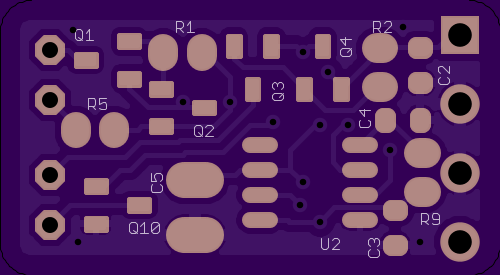
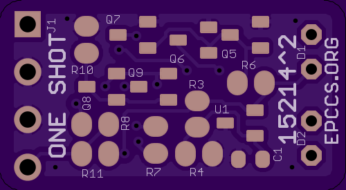
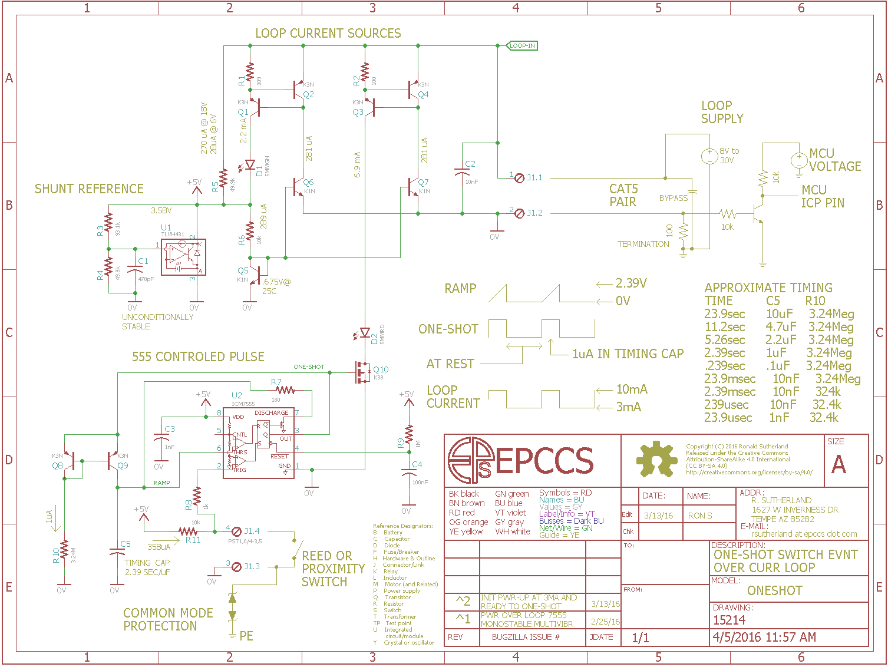

# OneShot Pulse Extender

## Overview

Monostable Multivibrator Circuit that triggers immediately while ignoring input (switch) during its activation time, e.g. further switch closures do not alter output or timing.


## Inputs/Outputs/Functions

```
        One Shot or Pulse Extender
```


## Uses

```
        Ignore switch bounce after the initial closing.
        Lockout time for a single interrupt service routine to run.
```


# Table Of Contents

1. [Status](#status)
2. [Design](#design)
3. [Bill of Materials](#bill-of-materials)
4. [How To Use](#how-to-use)


# Status


```
        ^2  Done: Design, Layout, BOM, Review*, Order Boards, Assembly, Testing, 
            WIP: Evaluation
            Todo:
            *during review the Design may change without changing the revision.
            Hold reset active until after power is stable.
```

Debugging and fixing problems i.e. [Schooling](./Schooling/)

Setup and methods used for [Evaluation](./Evaluation/)


# Design

The board is 0.063 thick, FR4, two layer, 1 oz copper with ENIG (gold) finish.





## Electrical Schematic




## Testing

Check correct assembly and function with [Testing](./Testing/)


# Bill of Materials

The BOM is a CVS file(s), import it into a spreadsheet program like LibreOffice Calc (or Excel), or use a text editor.

Option | BOM's included
----- | ----- 
A. | [BRD] 
M. | [BRD] [SMD] [HDR] 
W. | [BRD] [SMD] [HDR] [PLUG]

[BRD]: ./Design/15214BRD,BOM.csv
[SMD]: ./Design/15214SMD,BOM.csv
[HDR]: ./Design/15214HDR,BOM.csv
[PLUG]: ./Design/15214PLUG,BOM.csv

[Order Form](https://rpubus.org/Order_Form.html)


# How To Use

Some proximity switches sense distance to objects by inductance, as the distance shortens magnetic fields increase and cause the reed switch to close. Some flow meters use this method to indicate a paddle wheel or turbine revolution. There is a verity of position and rotation measurement applications for magnetic switches because they cost 
little.

The reed switch may need its bounce masked but it is desirable to preserve the earliest indication without causing a storm of interrupt events in the microcontroller.

A few years ago someone had a project that had a liquid meter calibration device (a.k.a. a pipe prover) that had a few switches used to indicate the position of a displacer for volume measurements. Each time the positive displacement device (pipe pig) passed a switch it closed a number of times as multiple stages of the device moved past but for volume between switches the initial closure was needed. The displacer could move slowly during volume measurement, which is done by drawing water through the volume (e.g. the displacer moves slowly during water draw or gravimetric testing). Which determines the minimum One-Shot time. The fastest the displacer can move between the switches determines the maximum One-Shot time. At the time I did not understand the problem very well but with more flow meter experience I do. I have not seen an off the shelf option to help with this. I am looking to add this circuit to a board I call [Gravimetric] so I can try some proving ideas on my flow meters (and learn some more).

[Gravimetric]: https://github.com/epccs/Gravimetric


When the switch closes the loop current is held at 10mA for a defined time, the switch is ignored durring this time. Once the output returns to the 3mA level another one-shot may be started.

```
            APPROXIMATE TIMING
            TIME        C5     R10
            23.9sec     10uF    3.24Meg
            11.2sec     4.7uF   3.24Meg
            5.26sec     2.2uF   3.24Meg
            2.39sec     1uF     3.24Meg
            .239sec     .1uF    3.24Meg
            23.9msec    10nF    3.24Meg
            2.39msec    10nF    324k
            239usec     10nF    32.4k
            23.9usec    1nF     32.4k
```


This time is determined by how long it takes C4 to ramp to 2.39V from the 1uA current source set with R10. C5 is discharded to 0V after ramp. 