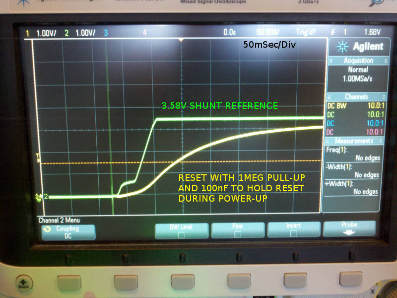
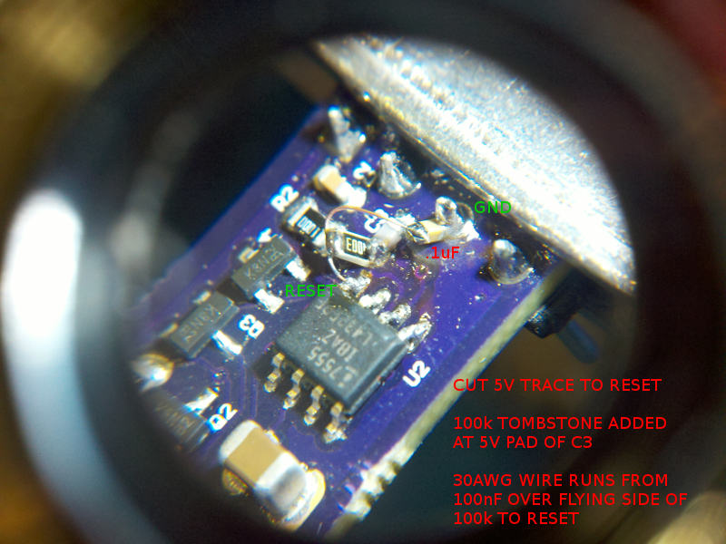

# Description

Some lessons I learned doing OneShot.

# Table Of Contents:

1. ^2 Initial Power-up State at Low Vin.
1. ^1 Initial Power-up State not Defined.
1. ^0 Thermal Shocked Ceramic Capacitor 

## ^2 Initial Power-up State at Low Vin.

The 100k pullup (R9 on ^2) on the reset pin changed to 1Meg to hold the 555 in reset state longer and allow a correct startup state with a low loop voltage.

## ^1 Initial Power-up State not Defined.

One option is to ignore the initial power-up state, I do not like that.
    
Note a capacitance between ground and the 555 trigger input did not help. This is a reset issue. When I added 100nF to the reset input and a 100k pullup it forces the 555 into a reset state until after power up is complete. 

[OneShot^1A Rework](15214^1A,Schematic.pdf)

## ^0 Thermal Shocked Ceramic Capacitor 

The first unit I built suffered from a thermal shocked ceramic capacitor, its delay kept decreasing since the capacitor leakage current kept increasing. It is very difficult to hand solder or repair ceramic capacitors (small ones do better).

Unfortunately, there is not an easy fix for this, I have to use a reflow oven with a controlled  thermal ramp rate, touching the hot iron to the ceramic is about the worst thing imaginable. To give myself a chance I cool the iron down then place the cold tip against the part and pad and turn it on and off a few times to ramp up the temperature. I now have a toaster oven setup.