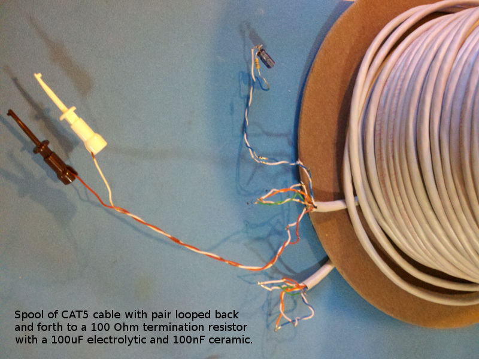

# Description

This is a list of Test preformed on each board after assembly.

# Table of References


# Table Of Contents:

1. Basics
2. Assembly check
3. IC Solder Test
4. Bias
5. Connect USBuart


## Basics

These tests are for an assembled OneShot board 15214^2 which may be referred to as a Unit Under Test (UUT). If the UUT fails and can be reworked then do so, otherwise it needs to be scraped. 

__Warning__: never use a soldering iron to rework ceramic capacitors due to the thermal shock.

Items used for test.



## Assembly check

After assembly check the circuit carefully to make sure all parts are soldered and correct. The device marking is labeled on the schematic and assembly drawing.


## IC Solder Test

Check that a diode drop to 0V is present from a circuit board pad that is connected to each of the pins of the IC's. Measure with a DMM's diode test. Consult the schematic to determine which pins can be skipped.


## Bias

Set a supply to current limit at about 30mA and then set the voltage to about 10V, turn off the supply. Connect it to the wiring harness and then connect that to the DUT. Make sure the wires to the switch are open. Power the DUT. Verify that only the green LED is illuminated and that about 2.3 through 2.8mA is on the loop. Keep the power on.

Note: If the red LED is illuminated at power up and then turns off after a delay then please verify parts R10, C4, and their connections. This has been a problem area and the values used are not yet well vetted, I would also like to know if any problems are seen.

Note: If the loop is shorted check the twisted pair insulation, that is where I've seen problems after soldering.


## One-Shot

With the DUT in the inactive state (green LED alone) start a one-shot and verify that 9.1mA is flowing from the supply and that the red LED is illuminated. The timing will vary depending on parts that are used.

```
        APPROXIMATE TIMING
        TIME        C5      R10
        23.9sec     10uF    3.24Meg
        11.2sec     4.7uF   3.24Meg
        5.26sec     2.2uF   3.24Meg
        2.39sec     1uF     3.24Meg
        .239sec     .1uF    3.24Meg
        23.9msec    10nF    3.24Meg
        2.39msec    10nF    324k
        239usec     10nF    32.4k
        23.9usec    1nF     32.4k
```

